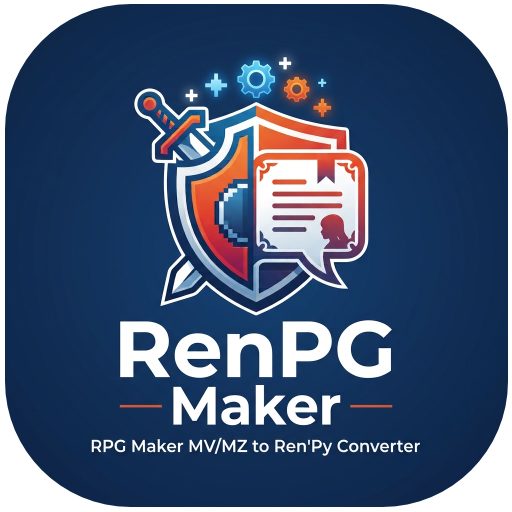
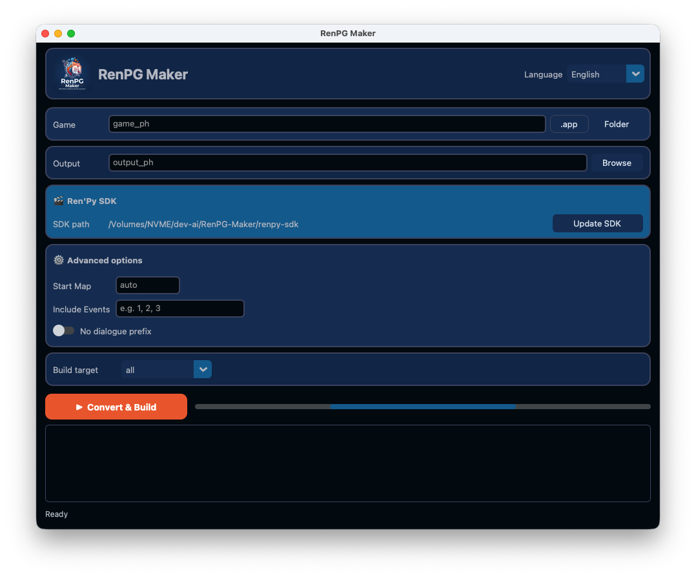

# 🎮 RenPG Maker




[](README_IT.md)

Convert **RPG Maker MV/MZ** games into **Ren'Py** visual novels, keeping only dialogues, choices, images, audio, variables and conditional branches.



## 🚀 Installation & Launch

```bash
# macOS / Linux
./start.sh

# Windows
start.bat
```

`uv` is installed automatically if missing. The `start.sh` / `start.bat` scripts also create a virtual environment and install the required dependencies.

You can also run the GUI directly:

```bash
python3 -m rpgm2vn.gui
```

Or use the command-line interface:

```bash
python3 -m rpgm2vn.cli /path/to/game/www/data /path/to/output
```

## 🎬 Convert & Build

The GUI also supports a one-click **Convert & Build** workflow:

1. Select the game and output folder.
2. Choose the build target: `all`, `win`, `mac` or `linux`.
3. Click **Convert & Build**.

The first time you build, Ren'Py SDK 8.5.3 is downloaded automatically into `renpy-sdk/`. After that, the project is converted and packaged for the selected desktop platform.

Encrypted RPG Maker MV/MZ assets (`.rpgmvp`, `.rpgmvo`, `.rpgmvm`, `.rpgmve`) are decrypted automatically using the key from `System.json`. Movies from the `movies/` folder are also copied into the project.

## 🎨 UI, icon and splash screen

The GUI uses a color palette inspired by the project logo, with the logo displayed at the top-left and the RenPG icon in the window title. The generated Ren'Py game also shows a splash screen before the main menu, using `img/splash.png`, displayed once per session for 2.5 seconds.

## 📦 Cross-platform bundles

In addition to the GUI's **Convert & Build** workflow, you can build standalone bundles for the platform of your choice:

### Source release (`build/build.sh`)

```bash
./build/build.sh
```

Generates `dist/RenPGMaker-v0.1.0.zip` with the project source files, ready to be distributed or run manually.

### macOS

```bash
./build/build_mac_app.sh
```

Creates a self-contained `dist/RenPGMaker.app` with the proper icon, embedded virtual environment and project files. It runs natively on Apple Silicon (M1/M2/M3) as well as Intel Macs.

### Linux

```bash
./build/build_linux.sh
```

Creates `dist/RenPGMaker-linux/` containing the project, `.venv` and a `start.sh` script to launch the GUI.

### Windows

```bat
build\build_windows.bat
```

Creates `dist\RenPGMaker-windows\` containing the project, `.venv` and `start.bat` to launch the GUI.

## 🙏 Credits

This project is based on [rpgm2renpy](https://github.com/selectivepaperclip/rpgm2renpy) by **selectivepaperclip**, which provided the starting point for the RPG Maker MV/MZ → Ren'Py conversion logic.
